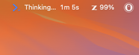
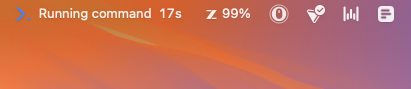
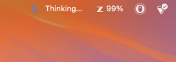
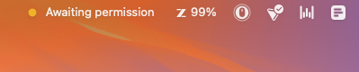
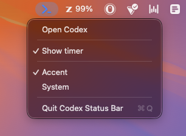

# Codex Status Bar

A tiny macOS menu bar app that shows the **Codex CLI's live status**: an animated spinner while it is thinking or running a tool, an amber dot when it is awaiting your approval, and the elapsed time of the current turn. It sits next to your battery and clock and stays out of the way — no window, no dock icon, no usage dashboards.

> Built so you can tab away during a long "thinking" stretch and still see, at a glance, whether Codex is working, waiting on you, or done.



## What it shows

- **Thinking / running a tool** — an animated spinner, with a live `1m 1s` timer.
- **Tool labels** — a short label for the current action (`Editing`, `Reading`, `Running command`, `Using tool`, …).
- **Awaiting approval** — an amber dot when Codex fires a `PermissionRequest`.
- **Idle / done** — the spinner rests when there is nothing to do.

Icon color can be **Accent** (`#4D8FFF`) or **System** (adaptive black/white, like your other menu bar icons). The elapsed timer can be toggled off. Both choices are saved in preferences.

| Running command | Timer hidden |
|---|---|
|  |  |

| Awaiting permission | Menu controls |
|---|---|
|  |  |

## Where it works

This is a **Codex CLI** indicator, driven by Codex hooks.

| Surface | Tracked? |
|---|---|
| Codex CLI (terminal) | ✅ |
| Codex desktop app | ✅ |
| Codex VS Code / IDE extension | ✅ |

All three run through the same Codex hook system — the desktop app and the VS Code extension drive it through the `codex` app-server. Hook firing was verified directly on each surface (confirmed via the session `originator` tag): the terminal CLI (`codex_exec`), the VS Code extension (`codex_vscode`), and the desktop app (`Codex Desktop`).

## One-time setup: trust the hooks

Codex reviews command hooks before it will run them. The first time Codex sees the Codex Status Bar hooks, it asks you to approve them in a one-time startup trust review:

1. After installing (below), run `codex` once.
2. Approve the Codex Status Bar hooks when Codex shows the startup trust review.
3. Until you approve, **the indicator stays idle** — the hooks do not run, so nothing is written for the app to show.

Approval is tied to the exact contents of the hooks. **Updating the app can change the hooks, which requires approving them again** on the next `codex` start. This is a one-time step per version, not something you do every session.

## Requirements

- macOS 12+
- [Codex CLI](https://github.com/openai/codex) — hooks are default-on since v0.137 (codex-cli 0.137.0+)
- Node.js (used by the lightweight hook scripts)

## Install — DMG

1. Download the latest `CodexStatusBar.dmg` from the [Releases page](https://github.com/KiwiGaze/codex-status-bar/releases/latest).
2. Open it and drag **Codex Status Bar** into Applications.
3. Launch it once — on first launch it wires up the Codex hooks for you automatically (via the bundled installer).
4. Start (or restart) `codex` and **trust the hooks** in the startup review (see [One-time setup](#one-time-setup-trust-the-hooks)). The spinner appears whenever Codex is running.

> The DMG is signed and notarized, so it opens normally — no Gatekeeper warning, no right-click needed.

If first-launch setup ever does not take, you can run it manually:

```bash
node "/Applications/Codex Status Bar.app/Contents/Resources/install.js"
```

## Install — Codex plugin

The repository ships a Codex plugin manifest under `.codex-plugin/`. Install it through Codex's plugin flow to wire up the hooks from inside Codex. You will still drag the app into Applications once (the plugin launches it on session start), and you will still trust the hooks on the next `codex` start.

## Privacy — what the hooks read and write

The hook scripts run locally and make **no network requests**. On each Codex event they read
`session_id`, the current working directory (only its basename, shown as the project name),
`tool_name`, and `transcript_path`, and they write status files under `~/.codex/statusbar/`
(`states.d/`, `sessions.d/`). Setting `CODEX_STATUSBAR_DEBUG=1` additionally appends tool
names and payload keys to `~/.codex/statusbar/hooks.log`. The app itself also appends turn-timeout
records to `~/.codex/statusbar/app.log`. Nothing leaves your machine.

To remove everything: run the uninstaller (below) and delete `~/.codex/statusbar/`.

## How it works

Codex fires hooks on its lifecycle events. Small Node scripts write the current status to per-session files under `~/.codex/statusbar/states.d/`; the menu bar app polls them and renders the spinner, label, and timer.

The `SessionStart` hook launches the app. Codex has no `SessionEnd` event, so the app decides for itself when to leave: it **stays while a `codex` process is running** — a CLI session, `codex exec`, or the app-server that backs the desktop app and the VS Code extension — and **rests quietly (just the icon) when idle**. It quits a few seconds after Codex fully closes (no `codex` process and no recently-active session). So if you keep the Codex desktop app open, the indicator stays too (resting when idle); on a CLI-only machine it comes and goes with your `codex` sessions.

The installer merges its hooks into `~/.codex/hooks.json` without touching your other hooks, and backs the file up first (`~/.codex/hooks.json.bak-statusbar`).

## Uninstall

```bash
node "/Applications/Codex Status Bar.app/Contents/Resources/uninstall.js"   # removes only our hooks
```

Then drag the app to the Trash.

## Build from source

```bash
./build.sh            # builds build/Codex Status Bar.app
./build.sh --dmg      # also produces build/CodexStatusBar.dmg
```

Requires the Xcode Command Line Tools (`xcode-select --install`).

## Development

Run the tests:

```bash
node --test Tests/install.test.mjs
node --test Tests/update.test.mjs
swiftc Tests/logic_tests.swift Sources/SessionState.swift -o /tmp/csbt && /tmp/csbt
```

See [CONTRIBUTING.md](CONTRIBUTING.md) for the build, formatting, and PR workflow.

## Not affiliated

This is an unofficial, open-source project. **It is not affiliated with, endorsed by, or sponsored by OpenAI.** The name "Codex" is used only to describe interoperability with the Codex CLI.

## Credits

Based on the MIT-licensed [Claude Status Bar](https://github.com/m1ckc3s/claude-status-bar) by Mick Cesanek — a menu bar status indicator for Claude Code (see [NOTICE](NOTICE)). Codex Status Bar adapts its build script, hook scripts, and menu bar app for the Codex CLI's hook system, with an original visual identity.

## License

[MIT](LICENSE)
